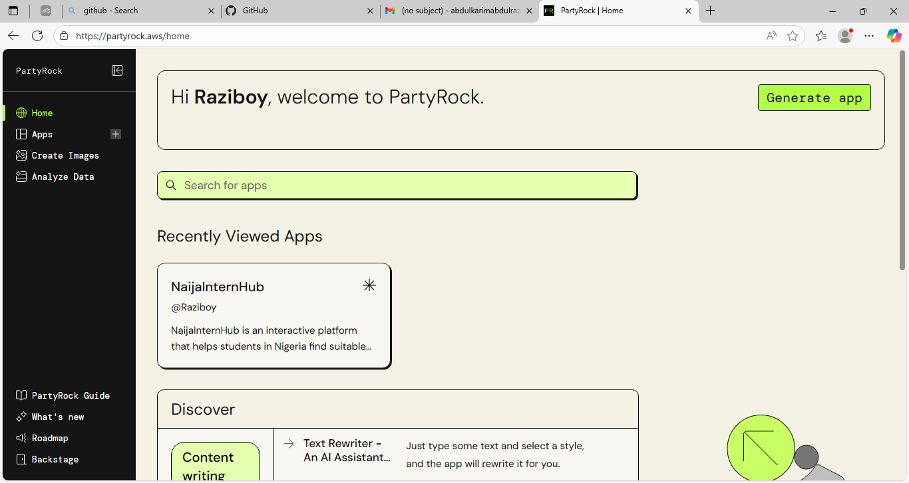
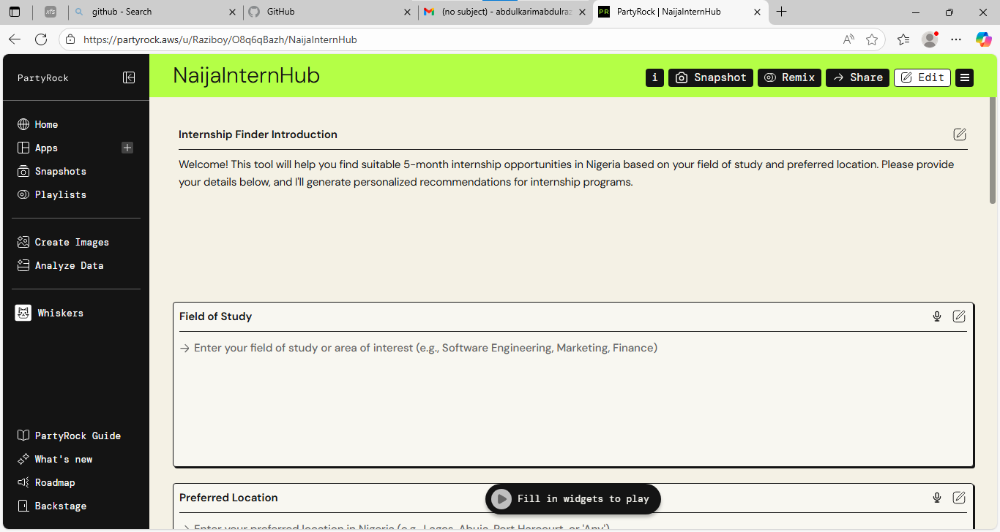
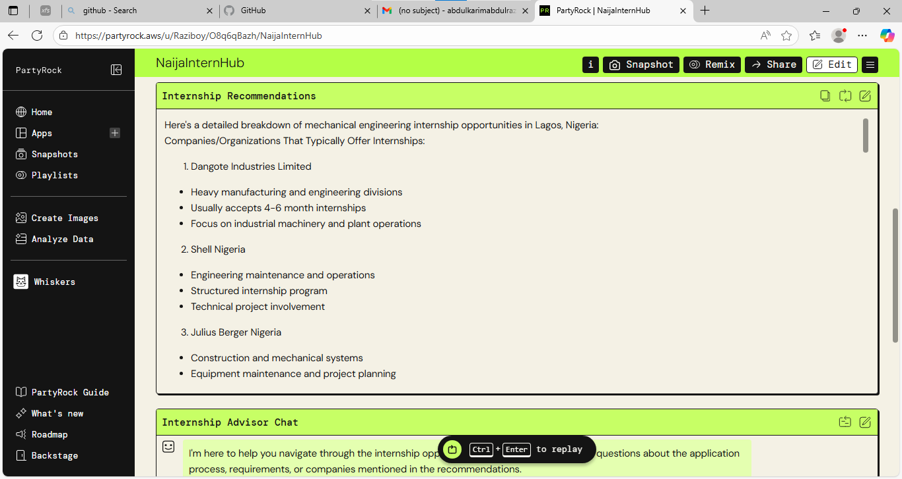

# 🌍 NaijaInternHub

🔗 **Live Demo:** [Try NaijaInternHub on PartyRock](https://partyrock.aws/u/Raziboy/O8q6qBazh/NaijaInternHub)

---

##  Overview
**NaijaInternHub** is an AI-powered internship discovery platform built with **[PartyRock by AWS](https://partyrock.aws/)**.  
It is designed to help Nigerian students and graduates easily **find, filter, and apply for internships** that match their skills, interests, and location.  

---

##  Features
-  **Smart Matching** — AI recommends internships based on your skills and preferences.  
-  **Filtering & Search** — Narrow results by industry, role, location, or remote/on-site.  
-  **Internship Insights** — Get extra details like competitiveness and deadlines.  
-  **Personalized Feed** — Recommendations improve the more you use it.

---

## Screenshots

### App Home

### Search Filters

### Internship Search

### Internship Results

---

## How It Works
1. User enters profile details (skills, education, interests, preferred locations).  
2. AI matches the profile with available internships.  
3. Results are displayed with filters for refining searches.  
4. Users can explore opportunities and plan applications.  

---

## Repository Structure
